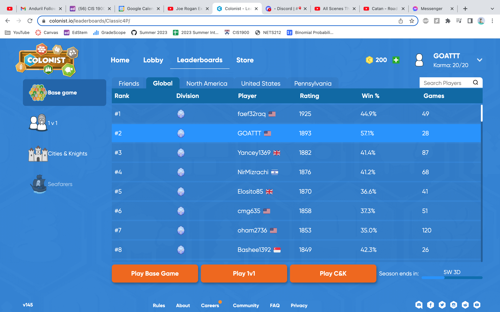

# CIS1900Final Project Proposal
## Team:
Tahmid Ahamed & Albert Wang
## Project Proposal:
Settlers of Catan
## Description of Project:
Our project plans to recreate the classic board game Settlers of Catan. The motivation behind the project is that both Tahmid and Albert are avid Catan players. As of writing this, Albert is currently the 2nd ranked player in the world on colonist.io, the most popular online Catan simulator.  
  
Catan is a complex board game, therefore we are confident this project will pass the complexity threshold. The game is played on 19 hexagonal tiles making it different from the classic square-tiled board games. There are 5 types of resources in the game: wood, brick, sheep, wheat, and ore. Players can use these resources to purchase four items: settlement, city, road, and development card. There are five types of development cards: knight, year of plenty, road building, monopoly, and victory point. The game is typically played between 2-4 players and the end goal is to be the first player to reach 10 victory points (although 10 can vary). The game is played through turns, where each player has a turn and it rotates clockwise. In each turn, a player rolls two dice. The sum determines the roll of the turn, allotting the deserved resources to the player. Catan also includes concepts such as ports, robber, and longest road/largest army.
## Technical features/project structuring:
With 6 different types of hexagonal tiles, 5 types of resources, four purchasable items, and five types of development cards, we anticipated using some type of template/class hierarchy/OOP to demonstrate this.  
The libraries/frameworks of C++ we anticipate using are <algorithm>, <list, vector, deque, iterator>, some type of basic GUI controller, <random> & <memory> for a random dice roll, <iostream, iomanip> to allow user to provide an input on their turn.  
We plan on using C++ smart pointers to indicate that a player has their current resources as they only temporarily have these resources before they spend them on something. We plan on using C++ unique pointers to indicate that a player has a certain port that they can trade their resources in. Additionally, unique pointers can be used for the longest road and largest army as only one player can have those at a time.  
One aspect we are not going to implement is trading as this will require a multiplayer aspect to it and include networks that we are not familiar with. Instead, our implementation will be a singleplayer version of Catan where the user plays for everyone at the board. Catan is quite complex so there may be other aspects we choose not to implement for sake of the project timeline.  
Finally, the project work distribution will be split as follows: Albert will implement the core game logic and Tahmid will implement the GUI interface and IOstream input/output. Overlap will be worked on together. We anticipate a simplified/buggy version of everything being implemented by next week, and debugging to take the final week.
